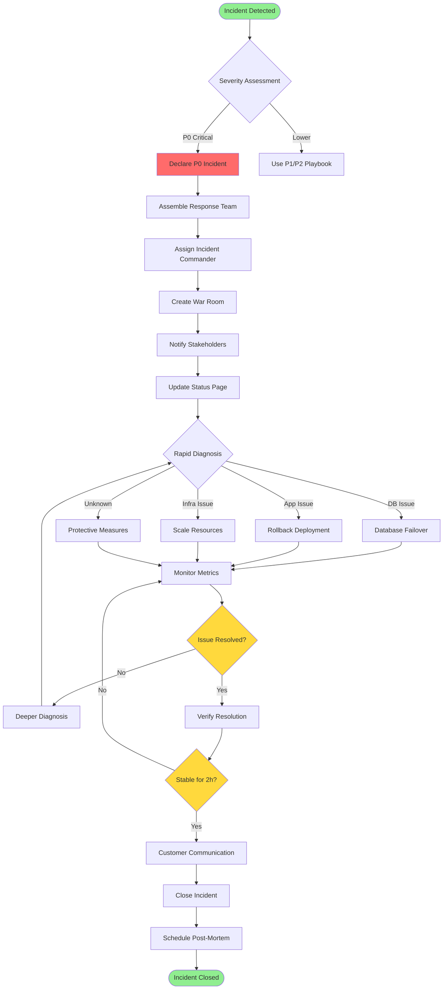
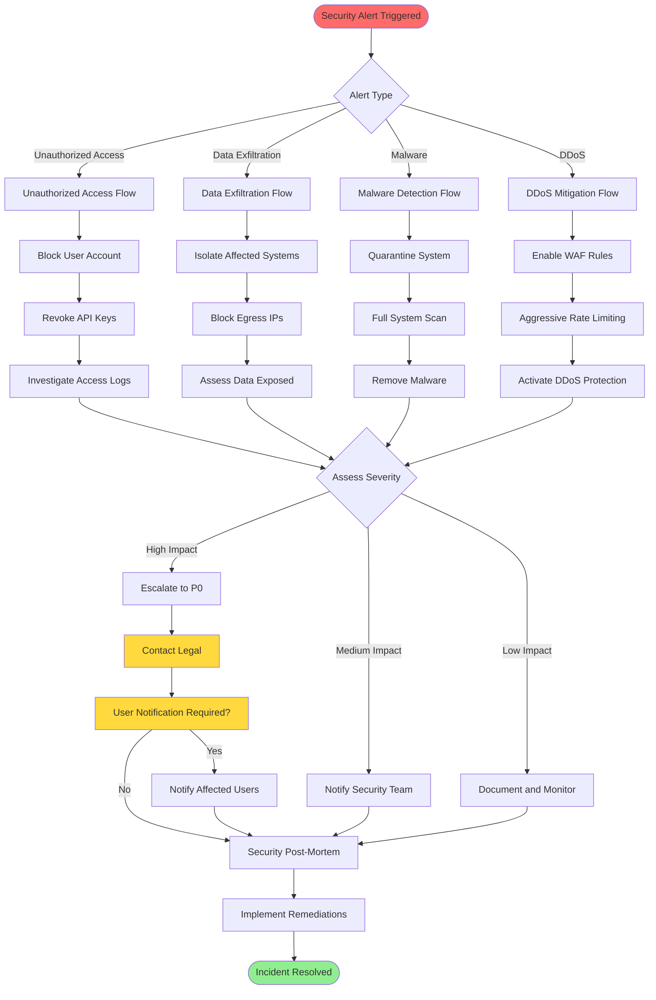

# NexusOS Workflow Diagrams

This document contains all workflow diagrams for NexusOS operations, incident response, and system processes.

## Diagram Sources

All diagrams are maintained as Mermaid source files in [mermaid_sources/](./mermaid_sources/) directory.

## Incident Response Diagrams

### 1. P0 Critical Incident Response Flow

**Source**: [01_p0_incident_response.mmd](./mermaid_sources/01_p0_incident_response.mmd)

### 2. Security Decision Tree

**Source**: [02_security_decision_tree.mmd](./mermaid_sources/02_security_decision_tree.mmd)

## See additional diagrams in rendered outputs at `outputs/diagrams/`

Generated diagrams available as:
- SVG (vector graphics)
- PNG (raster graphics)
- PDF (printable)

**Regenerate diagrams**: `npm run render:diagrams`
