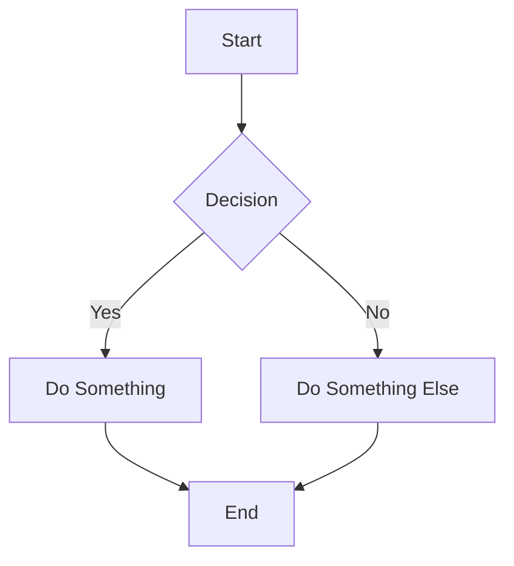

# Complete Guide to NexusOS Documentation Platform
## From Zero to Production in 30 Minutes

---

## Table of Contents

1. [Quick Start](#quick-start) (5 minutes)
2. [Basic Usage](#basic-usage) (10 minutes)
3. [Advanced Features](#advanced-features) (10 minutes)
4. [Customization](#customization) (5 minutes)
5. [Deployment](#deployment) (5 minutes)
6. [Troubleshooting](#troubleshooting)

---

## Quick Start

### Prerequisites

Before you begin, ensure you have:
- **Node.js** 20.0.0 or higher
- **npm** 10.0.0 or higher
- **Git** (for cloning the repository)
- **Python 3** (optional, for content auditing)

Check your versions:
```bash
node --version  # Should be v20.0.0+
npm --version   # Should be 10.0.0+
```

### Installation (2 minutes)

#### Step 1: Clone the Repository

```bash
git clone https://github.com/nexusos/docs-platform.git
cd docs-platform
```

#### Step 2: Install Dependencies

```bash
npm install
```

This will install all required packages (~30 seconds).

####Step 3: Build Documentation

```bash
npm run build
```

This generates:
- HTML documentation
- Search index
- Diagrams (if any Mermaid code exists)
- Slides (if any Marp files exist)

**That's it!** Your documentation is ready in `outputs/html/`

### View Your Documentation (1 minute)

Option 1: Open directly
```bash
open outputs/html/index.html  # macOS
xdg-open outputs/html/index.html  # Linux
start outputs/html/index.html  # Windows
```

Option 2: Use a local server
```bash
npx serve outputs/html
```

Then open http://localhost:3000

---

## Basic Usage

### Adding Your First Page

#### Step 1: Create a Markdown File

```bash
mkdir -p docs/01_getting_started
touch docs/01_getting_started/welcome.md
```

#### Step 2: Add Content

Edit `docs/01_getting_started/welcome.md`:

```markdown
---
title: Welcome to Our Documentation
version: 1.0.0
last_updated: 2024-01-15
---

# Welcome!

This is your first documentation page.

## Quick Start

Get started in 3 easy steps:

1. **Install the package**
   \`\`\`bash
   npm install our-awesome-package
   \`\`\`

2. **Import it**
   \`\`\`javascript
   import { awesome } from 'our-awesome-package';
   \`\`\`

3. **Use it**
   \`\`\`javascript
   const result = awesome.doSomething();
   console.log(result);
   \`\`\`

## Next Steps

- Read the [API Documentation](../02_api/README.md)
- Check out [Examples](../03_examples/README.md)
```

#### Step 3: Rebuild

```bash
npm run html
```

Your page is now available at `outputs/html/01_getting_started/welcome.html`

### Understanding the Directory Structure

```
docs/
├── 01_getting_started/     # Beginner content
│   └── welcome.md
├── 02_api/                 # API reference
│   └── endpoints.md
├── 03_guides/              # How-to guides
│   └── tutorial.md
└── 04_reference/           # Technical reference
    └── config.md
```

**Naming Convention:**
- Prefix with numbers for ordering (01, 02, 03...)
- Use descriptive folder names
- Use lowercase with hyphens for files

### Front Matter (Metadata)

Add metadata to each file:

```markdown
---
title: Page Title
version: 1.0.0
last_updated: 2024-01-15
author: Your Name
tags: [guide, beginner]
---
```

This metadata is used for:
- Search indexing
- Table of contents
- SEO optimization

---

## Advanced Features

### Interactive Search

The search feature works automatically once you build your docs.

**How it works:**
1. Build command generates `search-index.json`
2. Search UI loads the index
3. Client-side search (no backend!)

**Usage:**
- Press `/` to focus search bar
- Type to search
- Use `↑` `↓` to navigate results
- Press `Enter` to open page
- Press `Esc` to clear

**Customization:**
Edit `public/js/search.js` to change:
- Number of results shown
- Search behavior
- UI appearance

### Dark Mode

Dark mode is enabled by default.

**Features:**
- Automatic system preference detection
- Manual toggle button (sun/moon icon)
- localStorage persistence
- Smooth transitions

**Customization:**
Edit `public/css/themes.css` to change colors:

```css
:root[data-theme="dark"] {
  --color-bg-primary: #0f172a;  /* Main background */
  --color-text-primary: #f1f5f9;  /* Main text */
  --color-accent: #818cf8;  /* Links, buttons */
  /* ... more variables */
}
```

### Mermaid Diagrams

Add diagrams using Mermaid syntax:

````markdown

````

**Supported diagram types:**
- Flowcharts
- Sequence diagrams
- Class diagrams
- State diagrams
- Gantt charts
- Entity-relationship diagrams

**Build diagrams:**
```bash
npm run diagrams
```

Outputs SVG files to `outputs/diagrams/`

### Code Blocks

Add syntax-highlighted code:

````markdown
```javascript
function hello(name) {
  console.log(`Hello, ${name}!`);
}

hello('World');
```
````

**Supported languages:**
JavaScript, Python, Bash, JSON, YAML, HTML, CSS, Markdown, and more.

### Tables

Create tables with markdown:

```markdown
| Feature | Free | Pro | Enterprise |
|---------|------|-----|------------|
| HTML    | ✅   | ✅  | ✅         |
| Search  | ✅   | ✅  | ✅         |
| PDFs    | ✅   | ✅  | ✅         |
| Branded | ❌   | ✅  | ✅         |
| Support | ❌   | ✅  | ✅         |
```

### Slides (Marp)

Create presentation slides:

1. Create a `.marp.md` file:

```markdown
---
marp: true
theme: default
paginate: true
---

# My Presentation

Welcome to our product!

---

## Key Features

- Feature 1
- Feature 2
- Feature 3

---

## Demo

Let me show you how it works...
```

2. Build slides:
```bash
npm run slides
```

Outputs to `outputs/slides/`

---

## Customization

### Branding (Premium)

#### Step 1: Edit Configuration

Edit `branding/config.json`:

```json
{
  "companyName": "Your Company",
  "tagline": "Your Slogan",
  "website": "www.yourcompany.com",
  "email": "support@yourcompany.com",
  "logoUrl": "./branding/logo.png",
  "primaryColor": "#6366f1",
  "secondaryColor": "#1e293b",
  "classification": "Internal Use Only",
  "watermark": "CONFIDENTIAL",
  "showWatermark": false,
  "version": "1.0"
}
```

#### Step 2: Add Your Logo

Place your logo at `branding/logo.png`

**Specifications:**
- Format: PNG with transparent background
- Size: 200x60px (or similar aspect ratio)
- Color: Should work on dark backgrounds

#### Step 3: Generate Branded PDFs

```bash
npm run pdf-branded
```

Outputs to `outputs/pdf-branded/` with:
- Custom cover pages
- Your brand colors
- Company logo
- Headers and footers

### Custom Themes

#### Create a Custom Dark Theme

Edit `public/css/themes.css`:

```css
:root[data-theme="dark"] {
  /* Backgrounds */
  --color-bg-primary: #1a1a2e;
  --color-bg-secondary: #16213e;

  /* Text */
  --color-text-primary: #eee;
  --color-text-secondary: #aaa;

  /* Accent colors */
  --color-accent: #0f3460;
  --color-accent-hover: #e94560;

  /* Borders */
  --color-border: #2a2a3e;
}
```

### Adding Custom CSS

Create `public/css/custom.css`:

```css
/* Custom styles */
.docs-container {
  max-width: 1200px;
  margin: 0 auto;
}

.feature-box {
  padding: 20px;
  border-left: 4px solid var(--color-accent);
  background: var(--color-bg-secondary);
  margin: 20px 0;
}
```

Update `build/render_html.mjs` to include it.

---

## Deployment

### GitHub Pages

#### Step 1: Build Documentation
```bash
npm run build
```

#### Step 2: Deploy
```bash
npm run deploy
```

Or manually:
```bash
cd outputs/html
git init
git add .
git commit -m "Deploy documentation"
git branch -M gh-pages
git remote add origin https://github.com/yourusername/your-repo.git
git push -u origin gh-pages
```

#### Step 3: Enable GitHub Pages

1. Go to repository Settings
2. Navigate to Pages
3. Select `gh-pages` branch
4. Save

Your docs will be live at `https://yourusername.github.io/your-repo/`

### Netlify

#### Option 1: Netlify CLI

```bash
npm install -g netlify-cli
npm run build
netlify deploy --dir=outputs/html --prod
```

#### Option 2: Git Integration

1. Push your repo to GitHub
2. Connect repository on Netlify
3. Set build command: `npm run build`
4. Set publish directory: `outputs/html`
5. Deploy

### Vercel

```bash
npm install -g vercel
npm run build
vercel --prod outputs/html
```

### AWS S3 + CloudFront

```bash
# Build documentation
npm run build

# Sync to S3
aws s3 sync outputs/html s3://your-bucket/docs/ --delete

# Invalidate CloudFront cache
aws cloudfront create-invalidation \
  --distribution-id YOUR_DIST_ID \
  --paths "/*"
```

### Docker

#### Build and Run

```bash
# Build Docker image
docker build -t nexusos-docs .

# Run container
docker run -d -p 8080:80 nexusos-docs
```

Visit http://localhost:8080

#### Using Docker Compose

```bash
# Start services
docker-compose up -d

# Rebuild docs
docker-compose --profile build up builder

# Stop services
docker-compose down
```

---

## Troubleshooting

### Common Issues

#### "Command not found: npm"

**Solution:** Install Node.js from https://nodejs.org/

#### "Cannot find module 'xyz'"

**Solution:** Run `npm install` to install all dependencies

#### "Playwright browsers not found"

**Solution:**
```bash
npx playwright install chromium
```

#### "Python not found" (during audit)

**Solution:** Install Python 3.9+ or skip audit:
```bash
npm run build --skip-audit
```

#### Search not working

**Checklist:**
- [ ] Did you run `npm run index`?
- [ ] Does `outputs/search-index.json` exist?
- [ ] Does `outputs/manifest.json` exist?
- [ ] Are search JS/CSS files copied to `outputs/html/`?

**Fix:**
```bash
npm run index
npm run html
```

#### Dark mode toggle not showing

**Checklist:**
- [ ] Is `public/js/theme-switcher.js` present?
- [ ] Is it included in HTML output?
- [ ] Check browser console for errors

**Fix:**
```bash
npm run html
```

Hard refresh browser (Ctrl+Shift+R or Cmd+Shift+R)

#### Diagrams not rendering

**Checklist:**
- [ ] Is Mermaid CLI installed? (`npm list @mermaid-js/mermaid-cli`)
- [ ] Is syntax valid? Test at https://mermaid.live/
- [ ] Did you run `npm run diagrams`?

**Fix:**
```bash
npm install @mermaid-js/mermaid-cli
npm run diagrams
```

### Performance Issues

#### Slow build times

**Solutions:**
1. Build only what you need:
   ```bash
   npm run html  # Just HTML
   npm run diagrams  # Just diagrams
   ```

2. Use incremental builds (build only changed files)

3. Exclude large files from linting

#### Large output size

**Solutions:**
1. Optimize images before adding to docs
2. Use SVG instead of PNG for diagrams
3. Minify CSS/JS (add to build process)

### Getting Help

**Documentation:**
- Full docs: https://docs.nexusos.com
- GitHub README: https://github.com/nexusos/docs-platform

**Community:**
- GitHub Discussions: https://github.com/nexusos/docs-platform/discussions
- Discord: https://discord.gg/nexusos

**Support:**
- Free: GitHub Issues
- Pro: support@nexusos.com (48hr response)
- Enterprise: Phone support

---

## Best Practices

### Documentation Structure

**Good:**
```
docs/
├── 01_getting_started/
│   ├── README.md         # Overview
│   ├── installation.md   # How to install
│   └── quick-start.md    # 5-minute guide
├── 02_guides/
│   ├── basic-usage.md
│   └── advanced-features.md
└── 03_api/
    ├── README.md         # API overview
    ├── authentication.md
    └── endpoints.md
```

**Bad:**
```
docs/
├── stuff.md
├── things.md
├── more-stuff.md
└── random.md
```

### Writing Tips

1. **Start with "Why"**
   - Explain the purpose before the "how"
   - Show real-world use cases

2. **Use Examples**
   - Code examples for every concept
   - Screenshots where helpful

3. **Keep it Scannable**
   - Use headings
   - Bullet points
   - Short paragraphs

4. **Link Frequently**
   - Cross-reference related topics
   - Link to external resources

5. **Update Regularly**
   - Keep timestamps current
   - Remove outdated information
   - Archive old versions

### Version Control

**Commit messages:**
```
docs(api): add webhook documentation
docs(guides): update installation steps
fix(docs): correct broken links in readme
```

**Branch strategy:**
```
main         # Production docs
develop      # Staging docs
feature/*    # New content
hotfix/*     # Quick fixes
```

---

## Next Steps

### Learn More

- [ ] Read [Advanced Customization Guide](./CUSTOMIZATION.md)
- [ ] Explore [Deployment Options](./DEPLOYMENT.md)
- [ ] Check out [Examples](../examples/)

### Contribute

- [ ] Star the repo on GitHub
- [ ] Report issues or suggest features
- [ ] Submit pull requests
- [ ] Share with your team

### Upgrade to Pro

- [ ] Get branded PDFs
- [ ] White-label customization
- [ ] Priority support

[View Pricing](../business/SALES_PAGE.html)

---

## Appendix

### Keyboard Shortcuts

| Action | Shortcut |
|--------|----------|
| Focus search | `/` |
| Clear search | `Esc` |
| Navigate results | `↑` `↓` |
| Open result | `Enter` |
| Toggle theme | (Click sun/moon icon) |

### File Types Supported

| Type | Extension | Output |
|------|-----------|--------|
| Documentation | `.md` | HTML |
| Slides | `.marp.md` | HTML, PDF |
| Diagrams | `.md` (with mermaid blocks) | SVG |
| Configuration | `.json`, `.yml` | - |

### Build Commands Reference

| Command | Description | Output |
|---------|-------------|--------|
| `npm run build` | Build everything | All formats |
| `npm run build-premium` | Build with branding | All formats (branded) |
| `npm run html` | HTML only | `outputs/html/` |
| `npm run pdf` | Basic PDFs | `outputs/pdf/` |
| `npm run pdf-branded` | Branded PDFs | `outputs/pdf-branded/` |
| `npm run diagrams` | Render diagrams | `outputs/diagrams/` |
| `npm run slides` | Generate slides | `outputs/slides/` |
| `npm run index` | Build search index | `outputs/search-index.json` |
| `npm run lint` | Check markdown quality | - |
| `npm run audit` | Content quality check | Report |
| `npm run validate` | Validate structure | - |

---

**Congratulations!** You're now ready to create amazing documentation with NexusOS Docs. 🎉

**Questions?** Contact support@nexusos.com or visit our [community forum](https://community.nexusos.com).

Happy documenting! 📚
